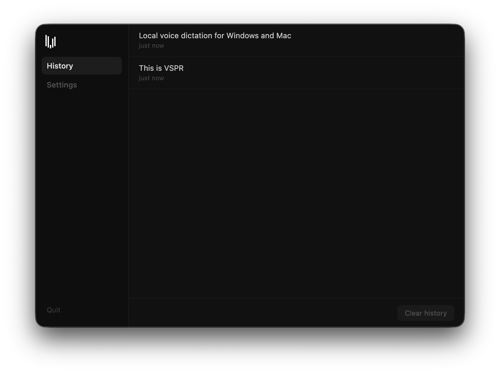
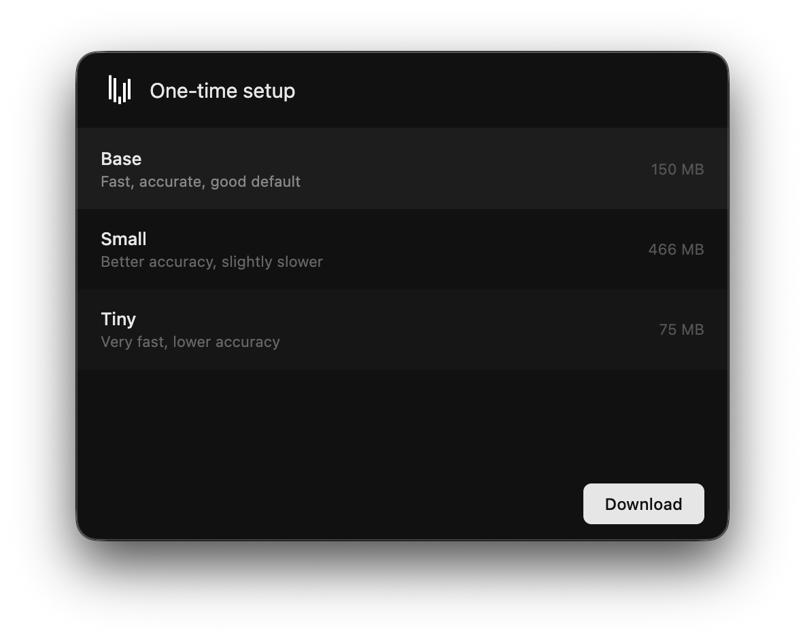

# Local, private voice dictation for Windows & Mac.

Note: At the time of making this, I did not have a Windows machine to test and debug the app. Please check out the Mac version for a better experience <3

## [IMPORTANT NOTE](NOTE.md)

## How It Works
1. Recording - captures mic input
2. Transcription - runs whisper.cpp locally on your device
3. Paste - copies to clipboard and pastes into the focused app

## Why?
Apps like Wispr Flow use off-device models for transcribing and editing text with AI. These apps send & store your private conversations.

VSPR was built to combat that, as a local-only tool, doing everything on-device. Your audio and transcriptions never leave your device. History is stored locally in your app data folder and can be cleared at any time.

## Getting Started

### Prerequisites

**Mac**
- MacOS Tahoe

**Windows**
- Windows 10 or later

### Installation

1. Download the latest release from the releases page
2. Open the installer, and follow the prompts
3. On first launch, VSPR will download a transcription model of your choice
4. Grant permissions

VSPR needs *microphone* and *accessbility* permissions to record your voice, and paste text into other apps.

## Models

VSPR offers a choice between the following whisper.cpp models:

## AI Usage

AI was used for debugging, and css-related code.

### Made with ❤️ by Ary
